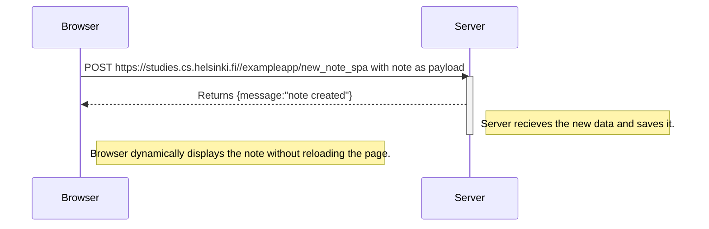

```mermaid

sequenceDiagram
    participant Browser
    participant Server

    Browser->>Server: POST https://studies.cs.helsinki.fi//exampleapp/new_note_spa with note as payload
    activate Server
    Server-->>Browser: Returns {message:"note created"}
    Note right of Server: Server recieves the new data and saves it.
    deactivate Server
    Note right of Browser: Browser dynamically displays the note without reloading the page.
```